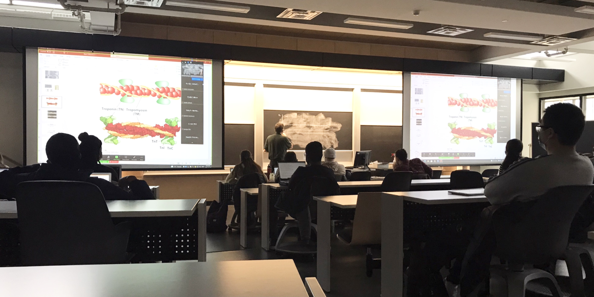

---
header:
  caption: ""
  image: ""
layout: docs
title: Courses
---

---
## BIOL 364 (Cell Physiology)
---

*This course covers general and specialized processes at the molecular and cellular level in eukaryotes and prokaryotes; protein folding and degradation, signalling by nerves, bioenergetics (respiration and photosynthesis), cell motility, muscle contraction, eukaryotic cilia and flagella, sensory perception, and fundamental immunology.

---
## BIOL 461 (Advanced Genetics)
---

*Through lectures and directed readings in classical and contemporary genetics, students are exposed to research literature and problems in this area. Students probe in greater depth areas of particular interest in order to develop a critical sense and deepen an understanding of past and current work in this field. 

---
*[Descriptions above](https://www.concordia.ca/academics/undergraduate/calendar/current/sec31/31-030.html#courses) taken directly from [Concordia University](https://www.concordia.ca/) 

