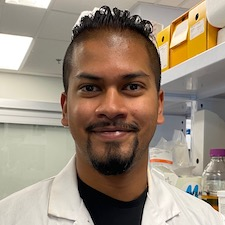
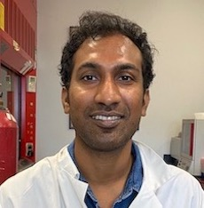

---
Dr. William Zerges, PhD
---
Principal Investigator

---
## Current Lab Members
---

Melanie Alfonso
---
MSc Candidate

Brandon Jaunky
---
MSc Candidate

Kristina Santilli
---
MSc Candidate

Srikanth Tirumani, PhD
---
Postdoctoral Fellow

Shiva Bakhtiari, PhD
---
Research Associate

James Dhaliwal, PhD
---
Research Associate

---
## Previous Lab Members
---
Postdoctoral Fellows
---

Yi Sun - PDF

Marco Schottkowski - PDF

Nadia Ait Ali - PDF

---
Graduate Students 
---

Elise Morel - PhD

Yu Zhan - PhD

James Uniacke - PhD

Melissa Valente-Paterno - MSc

Zheyu Zhao - MSc

Zhe Zhou - MSc

Madhav Soowamber - MSc

Matthew Peters - MSc

Oussama Rifai - MSc

Angel Stefanov - MSc

Ying Zhang - MSc

Munir Rahim - MSc

Dana Simon - MSc

Frederique Vigneault - MSc

Shenwu Wang - MSc

