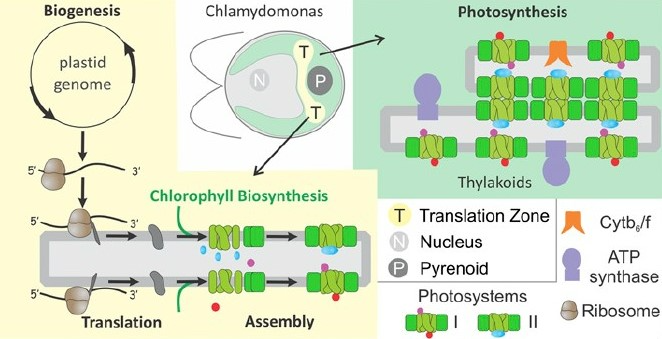
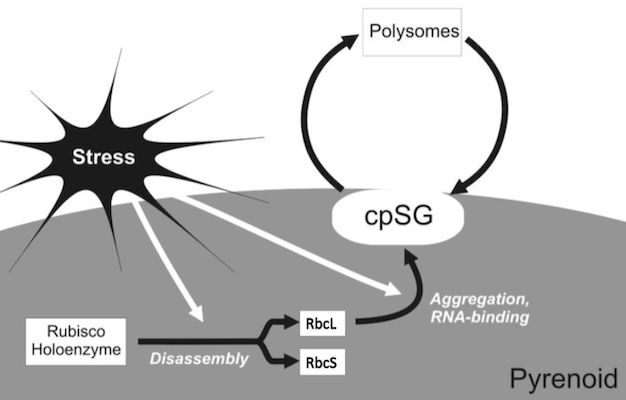

We are investigating cell biological processes in the chloroplast of *Chlamydomonas reinhardtii*. 

**Project 1.** Cells localize intracellular processes to specialized organelles in order to enhance their efficiency. For example, in plant and algal cells, chloroplasts carry out photosynthesis. Within chloroplasts, photosystems I and II carry out the initial steps in photosynthesis by harvesting light energy and converting it to chemical energy. Previous work in our lab revealed localized synthesis of photosystem II subunits in a discrete "translation zone" (T-zone) in the chloroplast of *Chlamydomonas*. However, it is unknown whether the T-zone organizes the synthesis and assembly of photosystem I subunits of chlorophyll biosynthesis.

**Project 2.** It was found previously that without the small subunit of Rubisco, unbound, free RBCL protein demonstrated a non-photosynthetic role and was required to control the level of oxidized RNA in cells and hydrogen peroxide stress tolerance. Our lab showed that for RBCL to have a moonlighting function, there must exist an RBCL pool that is different from the one in the Rubisco holoenzyme (involved in photosynthesis).

The primary goal of this project is to characterize the moonlighting function of RBCL that is responsible for controlling the effects of oxidative stress tolerance.

